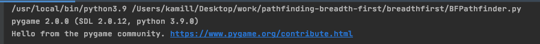
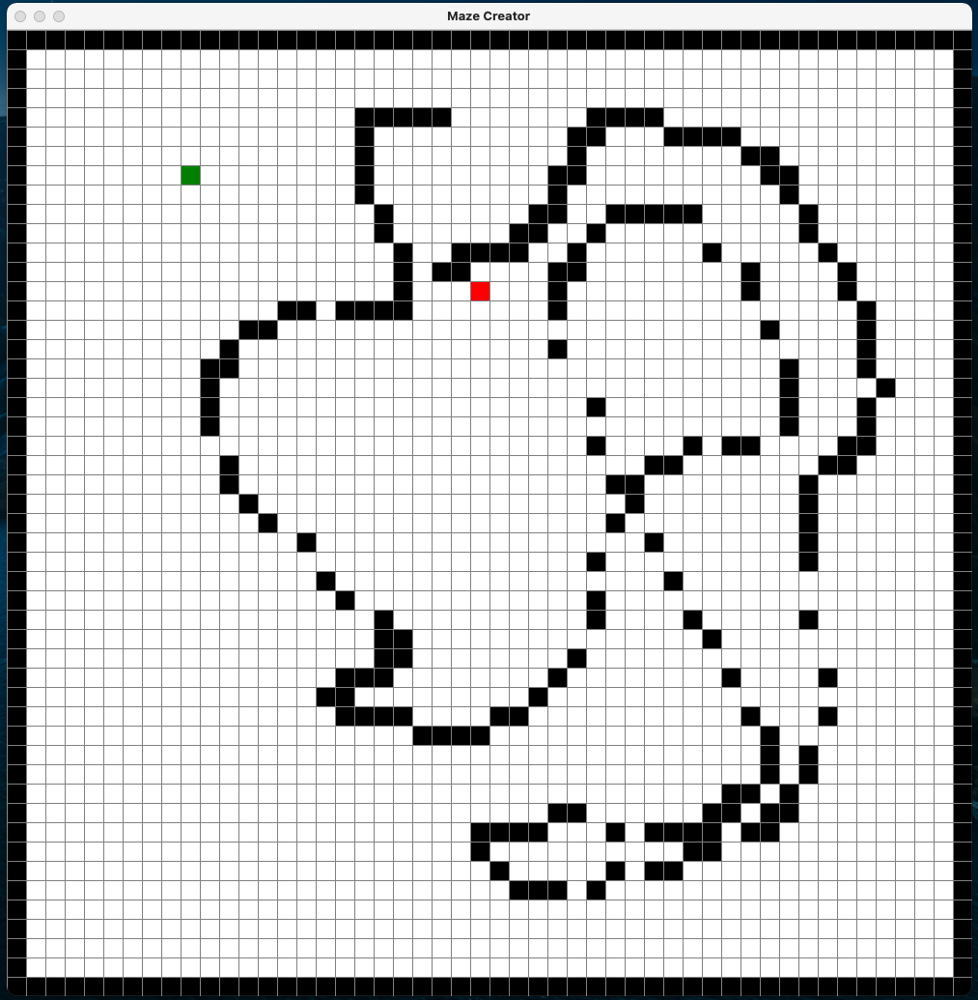
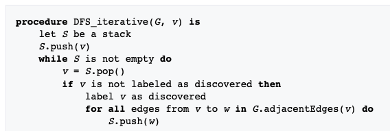
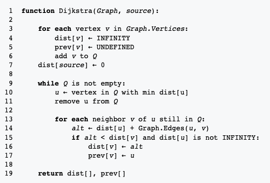
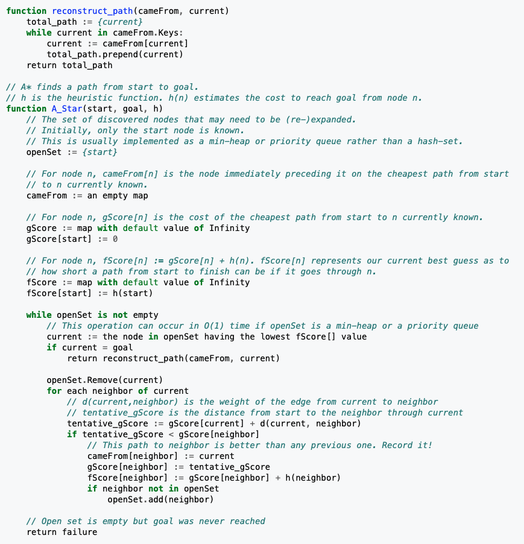

# Simple visualisations of various pathfinding algorithms

## BREADTH FIRST

https://en.wikipedia.org/wiki/Breadth-first_search

### Pseudocode

### Running the pathfinder

To run the pathfinder run the breadth_first/BFPathfinder.py file

- create maze
  
- press ENTER to export grid
- pathfinding result
  
- you can also inspect the moves that were made (including starting and ending pos)
  

-----------------------------------------------------------------

## DEPTH FIRST

https://en.wikipedia.org/wiki/Depth-first_search

### Pseudocode

### Running the pathfinder

To run the pathfinder run the depth_first/DFPathfinder.py file

-----------------------------------------------------------------

## DIJKSTRA'S ALGORITHM

https://en.wikipedia.org/wiki/Dijkstra%27s_algorithm

### Pseudocode

### Running the pathfinder

To run the pathfinder run the dijkstra/DijkstraPathfinder.py file

-----------------------------------------------------------------

## A* - MANHATTAN / TAXICAB DISTANCE

https://en.wikipedia.org/wiki/A*_search_algorithm

### HEURISTIC (APPROXIMATE) FUNCTION

https://en.wikipedia.org/wiki/Taxicab_geometry

### Pseudocode

### Running the pathfinder

To run the pathfinder run the a_star/taxicab/AStarPathfinder.py file
