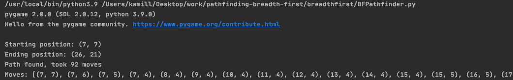

# Simple visualisations of various pathfinding algorithms

## BREADTH FIRST

https://en.wikipedia.org/wiki/Breadth-first_search

### Pseudocode

### Running the pathfinder

To run the pathfinder run the breadth_first/BFPathfinder.py file

- create maze
  
- press ENTER to export grid
- pathfinding result
  
- you can also inspect the moves that were made (including starting and ending pos)
  